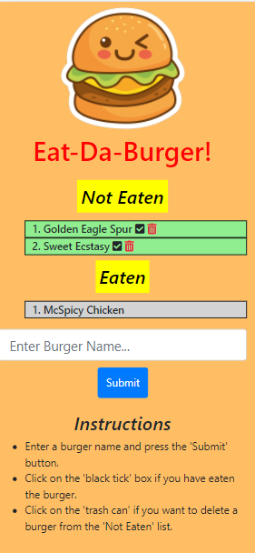

# Burger Logger

## Description

This is a mobile-first restaurant app that allows users to input the names of burgers they would like to eat.

## Table of Contents

[Deployment](#deployment)  
[Visuals](#visuals)  
[Usage](#usage)  
[License](#licenses)  
[Contributing](#contributing)  
[Questions](#questions)

## Deployment

<a href="https://ps-burger-logger.herokuapp.com/">Burger Logger (click to open)</a>

## Visuals

## Usage

Burger-savvy people can keep track of the burgers they have already eaten and the burgers that they are keen on eating sometime in the future. This app can be customized to log 'todos', goals, other food items and many more things.

## Licenses

The underlying source code used to format and display this content is licensed under the 

## Contributing

Prabh Singh

## Questions

My Github profile is <a href="https://github.com/prabhm512">prabhm512</a>.

If you have any questions regarding this project, please email prabhm512@gmail.com.
